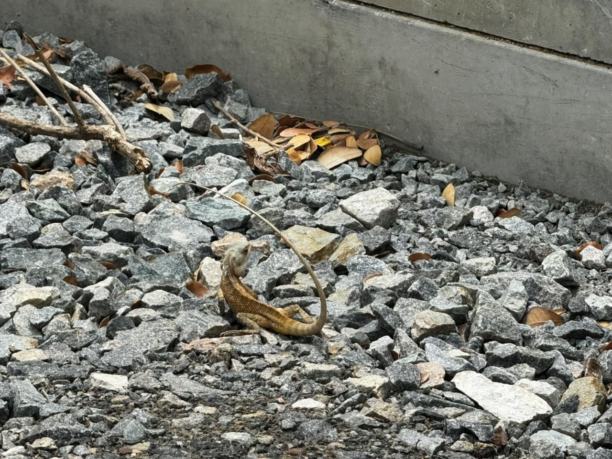

# Oriental Garden Lizard

**Scientific name:** *Calotes versicolor*

**Category:** Reptile

**Location(s) of observation:** Vegetation near garden plants

**Habitat:** Shrub/ornamental vegetation

## Photographs

*Garden lizard on vegetation*

---

Recorded by Team IOT-A during the Campus Biodiversity Survey (EVS Assignment 2), Shiv Nadar University Chennai.
