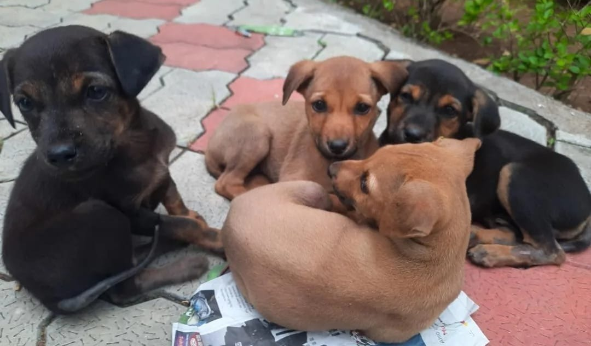

# Domestic Dog

**Scientific name:** *Canis lupus familiaris*

**Category:** Mammal (Carnivora: Canidae)

**Location(s) of observation:** Near Gents Hostel

**Habitat:** Open habitat

## Photographs

*Domestic dog near Gents Hostel*

---

Recorded by Team IOT-A during the Campus Biodiversity Survey (EVS Assignment 2), Shiv Nadar University Chennai.
