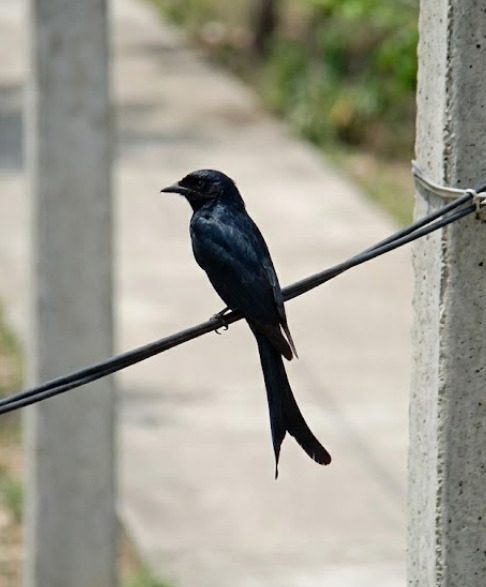

# Black Drongo

**Scientific name:** *Dicrurus macrocercus*

**Category:** Bird

**Location(s) of observation:** Near Gents Hostel

**Habitat:** Open campus edge habitat

## Photographs

*Black drongo perched on a wire*

---

Recorded by Team IOT-A during the Campus Biodiversity Survey (EVS Assignment 2), Shiv Nadar University Chennai.
