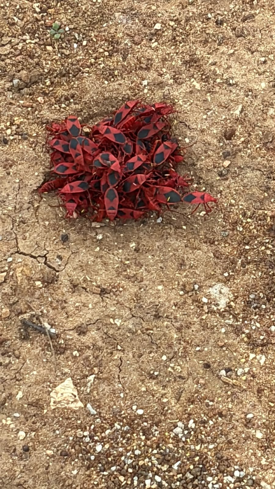

# Red Cotton Stainer Bug

**Scientific name:** *Dysdercus cingulatus*

**Category:** Insect (Hemiptera: Pyrrhocoridae)

**Location(s) of observation:** Near Gents Hostel

**Habitat:** Open habitat

## Photographs

*Red cotton stainer bugs in a cluster*

---

Recorded by Team IOT-A during the Campus Biodiversity Survey (EVS Assignment 2), Shiv Nadar University Chennai.
