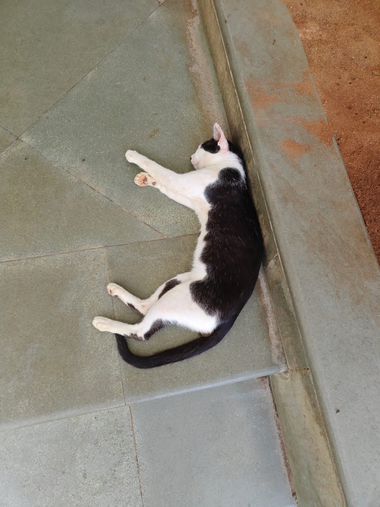

# Domestic Cat

**Scientific name:** *Felis catus*

**Category:** Mammal (Carnivora: Felidae)

**Location(s) of observation:** Near Canteen

**Habitat:** Open habitat

## Photographs

*Domestic cat near the canteen*

---

Recorded by Team IOT-A during the Campus Biodiversity Survey (EVS Assignment 2), Shiv Nadar University Chennai.
