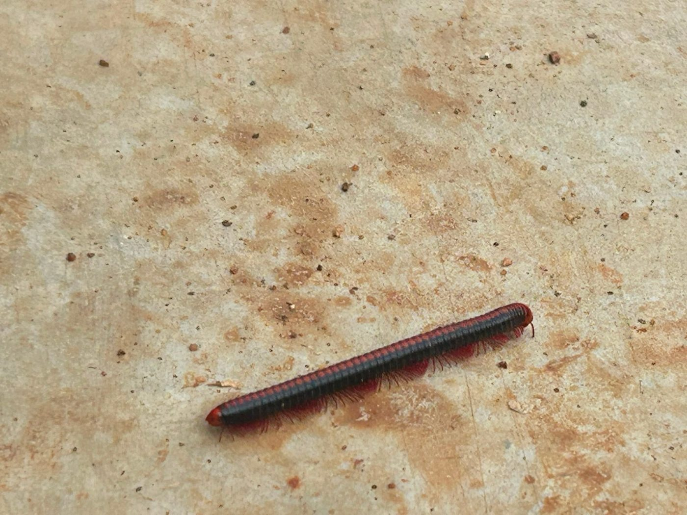

# Rusty Millipede

**Scientific name:** *Trigoniulus corallinus*

**Category:** Invertebrate (Diplopoda)

**Location(s) of observation:** Ground surface near Gents Hostel

**Habitat:** Leaf litter / soil-edge microhabitat

## Photographs

*Rusty millipede on open ground beside leaf litter*

---

Recorded by Team IOT-A during the Campus Biodiversity Survey (EVS Assignment 2), Shiv Nadar University Chennai.
