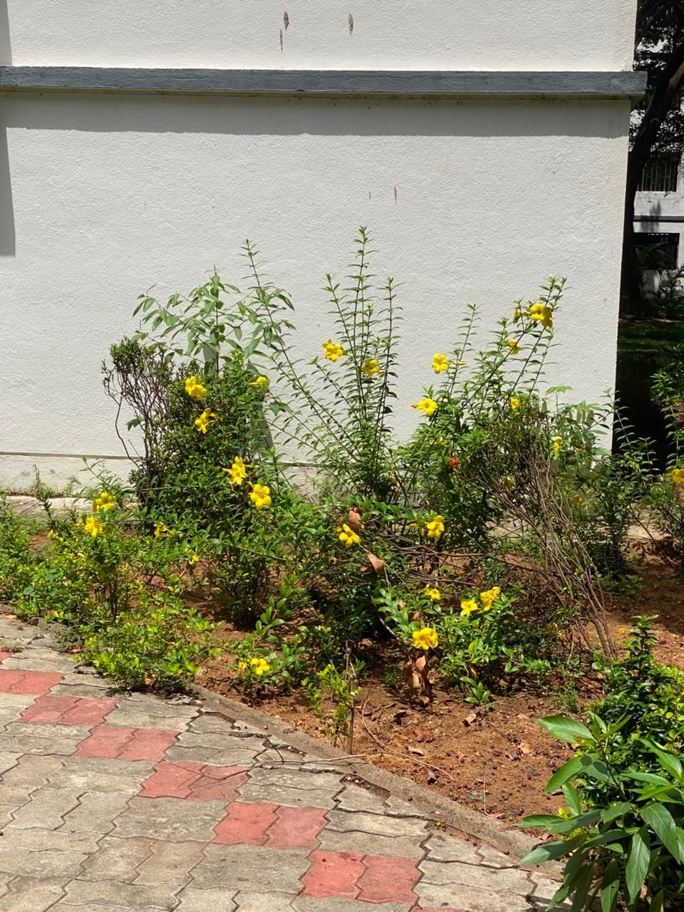

# Yellow Trumpet Flower

**Scientific name:** *Allamanda cathartica*

**Category:** Flowering climber/shrub

**Location(s) of observation:** Near Hostel Mess

**Habitat:** Managed garden habitat

## Photographs

*Yellow trumpet flowers near the Hostel Mess*

---

Recorded by Team IOT-A during the Campus Biodiversity Survey (EVS Assignment 2), Shiv Nadar University Chennai.
