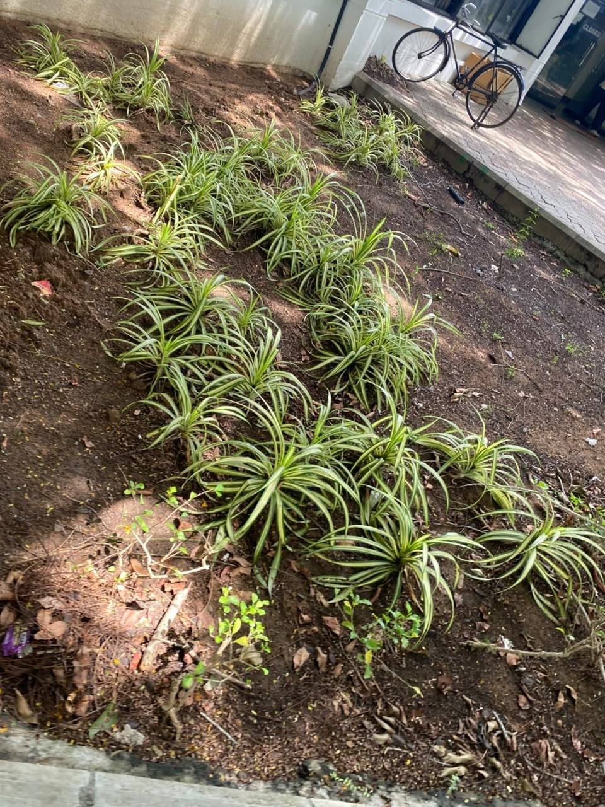

# Variegated Spider Plant

**Scientific name:** *Chlorophytum comosum*

**Category:** Herb (Amaryllidaceae)

**Location(s) of observation:** Near Gents Hostel

**Habitat:** Open habitat

## Photographs

*Variegated spider plant near Gents Hostel*

---

Recorded by Team IOT-A during the Campus Biodiversity Survey (EVS Assignment 2), Shiv Nadar University Chennai.
