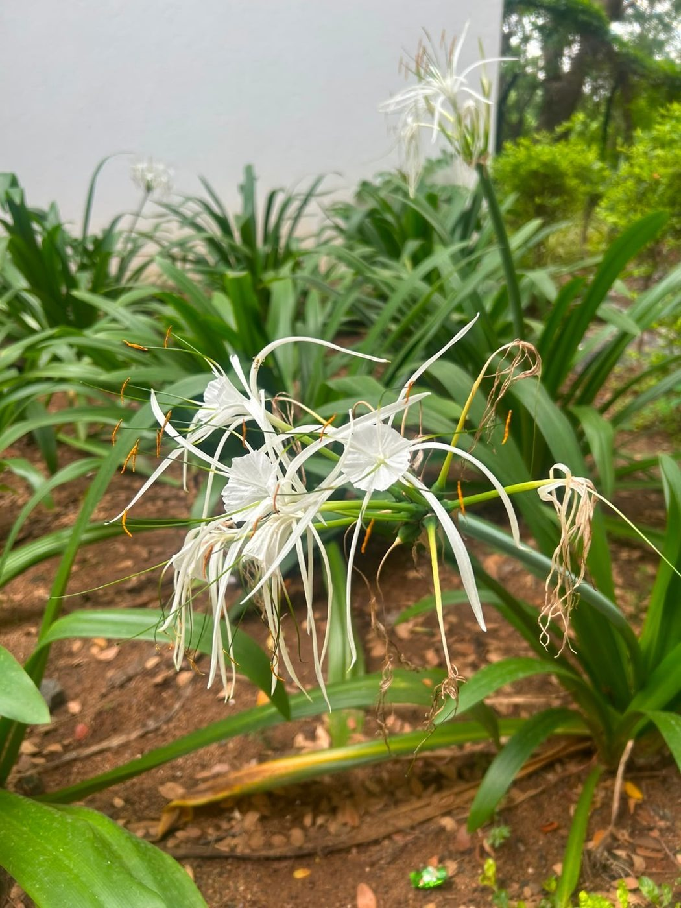

# Giant Crinum Lily

**Scientific name:** *Crinum asiaticum*

**Category:** Herb

**Location(s) of observation:** Canteen walkway

**Habitat:** Managed garden habitat

## Photographs

*Giant crinum lily along the canteen walkway*

---

Recorded by Team IOT-A during the Campus Biodiversity Survey (EVS Assignment 2), Shiv Nadar University Chennai.
