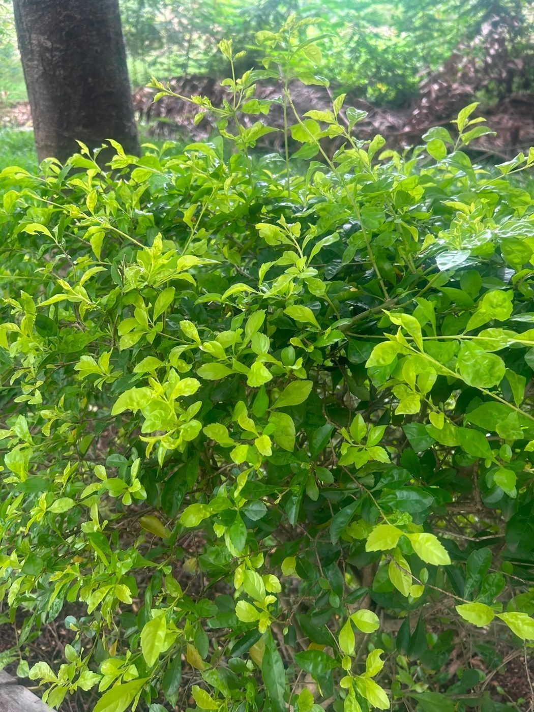

# Golden Dewdrop

**Scientific name:** *Duranta erecta*

**Category:** Shrub

**Location(s) of observation:** Shrub/hedge areas

**Habitat:** Managed shrub habitat

## Photographs

*Ornamental shrub/hedge, field-identified as Duranta erecta*

---

Recorded by Team IOT-A during the Campus Biodiversity Survey (EVS Assignment 2), Shiv Nadar University Chennai.
