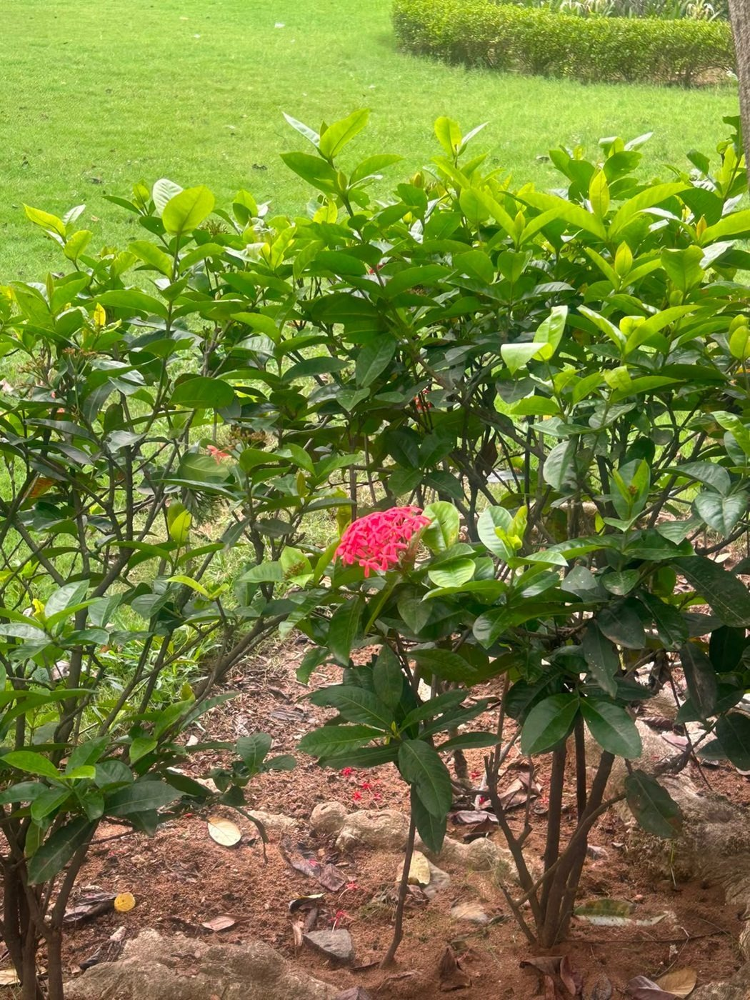
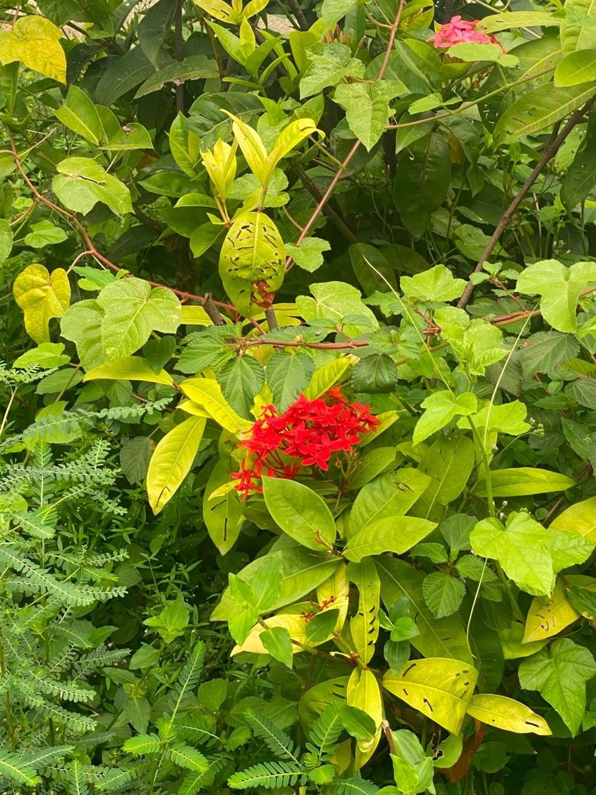
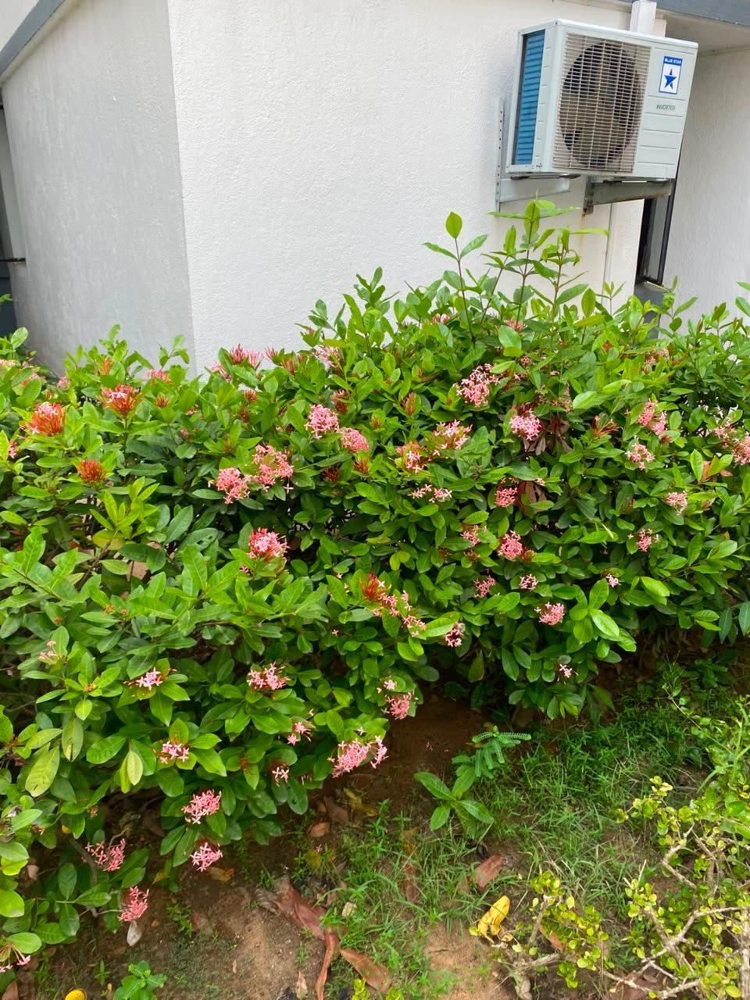
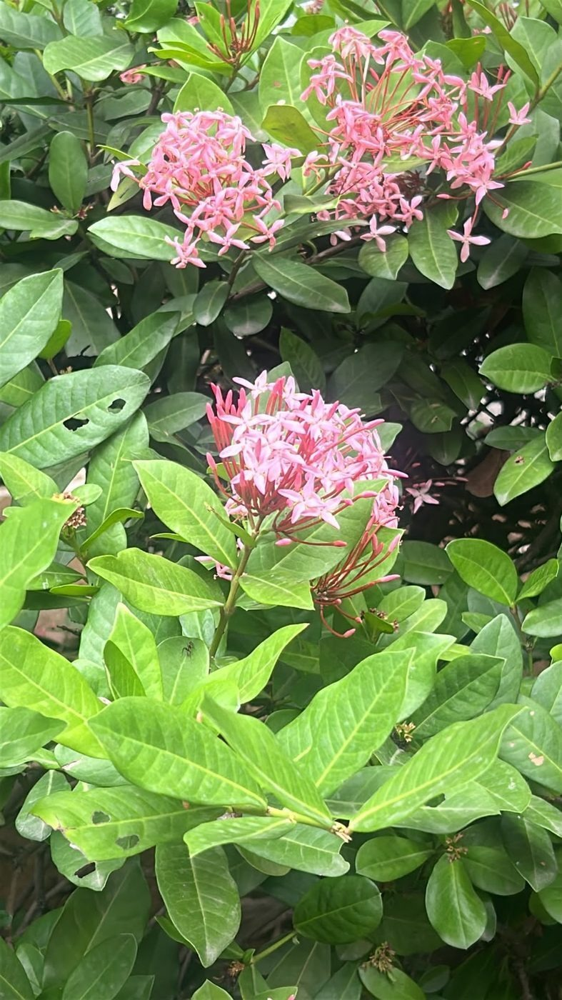

# Ixora / Jungle Geranium

**Scientific name:** *Ixora coccinea*

**Category:** Flowering shrub

**Location(s) of observation:** Near Gents Hostel

**Habitat:** Managed garden / shrub habitat

## Photographs

*Red-flowering Ixora in an ornamental shrub bed*

*Red-flowering Ixora surrounded by other campus vegetation*

*Pink-flowering Ixora hedge near a building*

*Pink Ixora flowers (close-up)*

---

Recorded by Team IOT-A during the Campus Biodiversity Survey (EVS Assignment 2), Shiv Nadar University Chennai.
