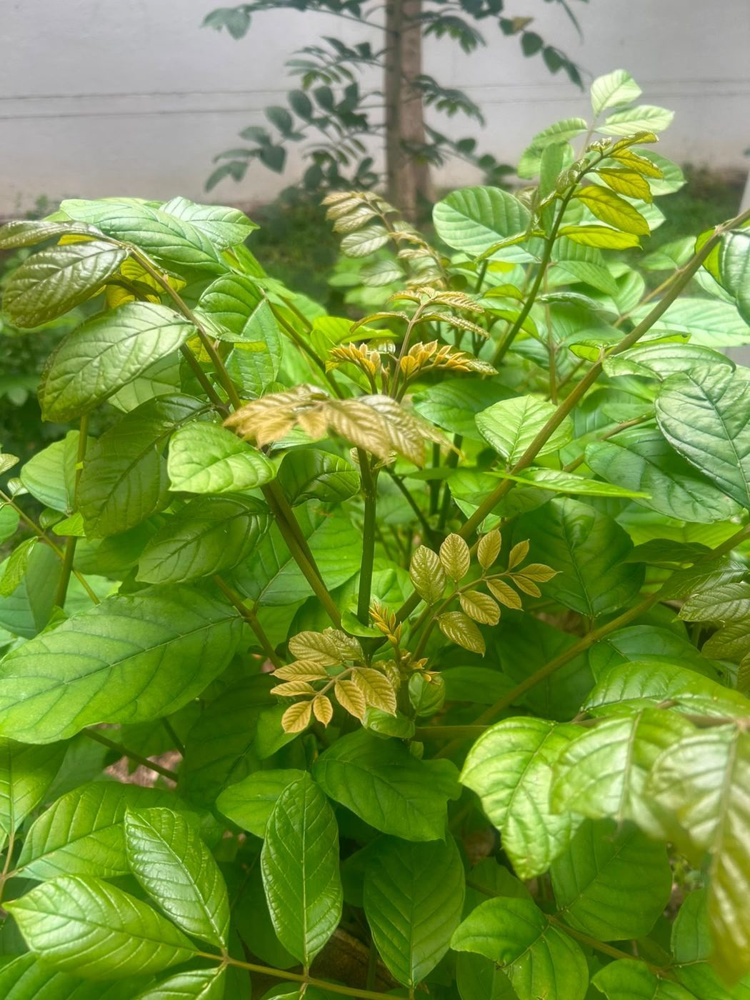

# Rambutan

**Scientific name:** *Nephelium lappaceum*

**Category:** Flowering plant (tree)

**Location(s) of observation:** Near Gents Hostel

**Habitat:** Open habitat

## Photographs

*Rambutan tree near Gents Hostel*

---

Recorded by Team IOT-A during the Campus Biodiversity Survey (EVS Assignment 2), Shiv Nadar University Chennai.
