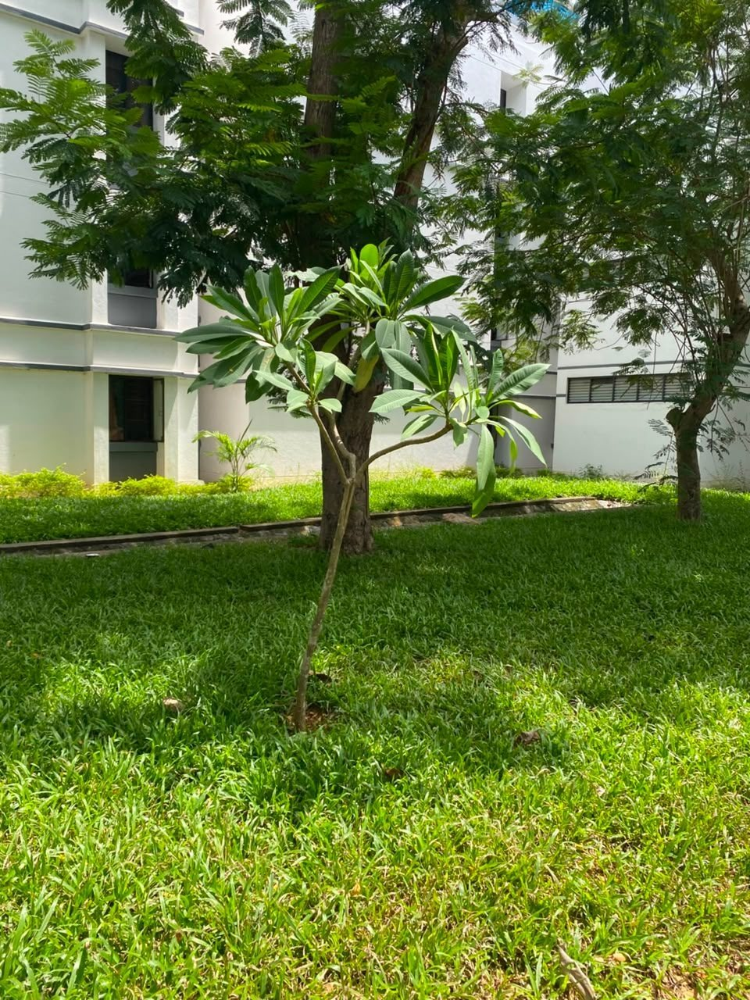
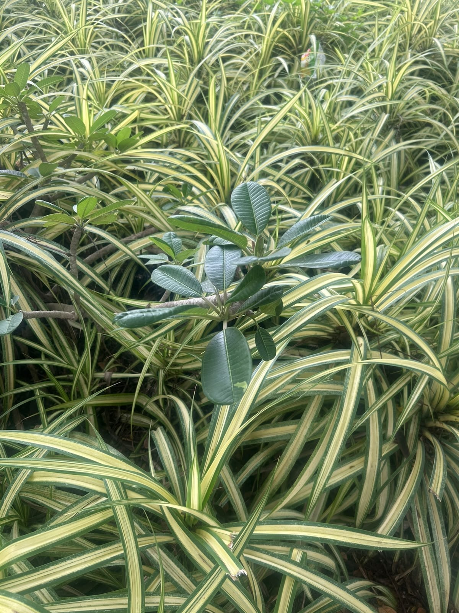

# Frangipani / Plumeria

**Scientific name:** *Plumeria rubra*

**Category:** Tree

**Location(s) of observation:** Hostel Lawn, Near Amphitheatre

**Habitat:** Campus lawn, tree and open habitat

## Photographs

*Frangipani tree in a lawn/garden area*

*Frangipani leaves near the Amphitheatre*

---

Recorded by Team IOT-A during the Campus Biodiversity Survey (EVS Assignment 2), Shiv Nadar University Chennai.
