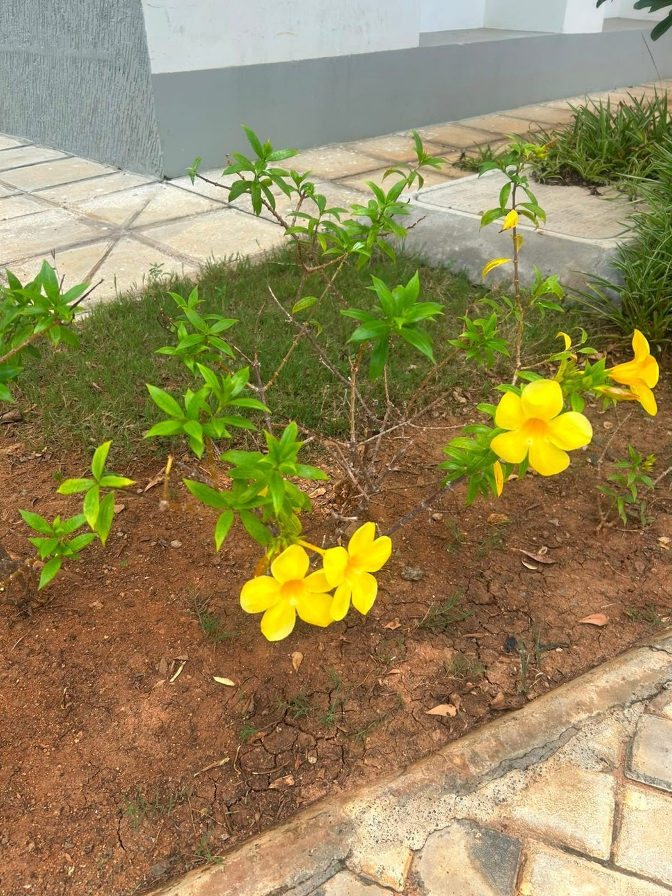

# Yellow Bells / Yellow Trumpetbush

**Scientific name:** *Tecoma stans*

**Category:** Flowering shrub

**Location(s) of observation:** Open garden bed beside walkway

**Habitat:** Managed garden / open habitat

## Photographs

*Yellow flowering shrub beside a campus walkway*

---

Recorded by Team IOT-A during the Campus Biodiversity Survey (EVS Assignment 2), Shiv Nadar University Chennai.
