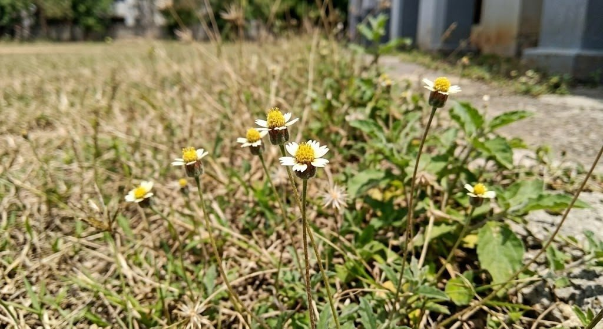

# Coatbuttons

**Scientific name:** *Tridax procumbens*

**Category:** Herb

**Location(s) of observation:** Near SSN

**Habitat:** Grassland-like disturbed habitat

## Photographs

*Coatbuttons growing at a grassy/open-ground edge*

---

Recorded by Team IOT-A during the Campus Biodiversity Survey (EVS Assignment 2), Shiv Nadar University Chennai.
